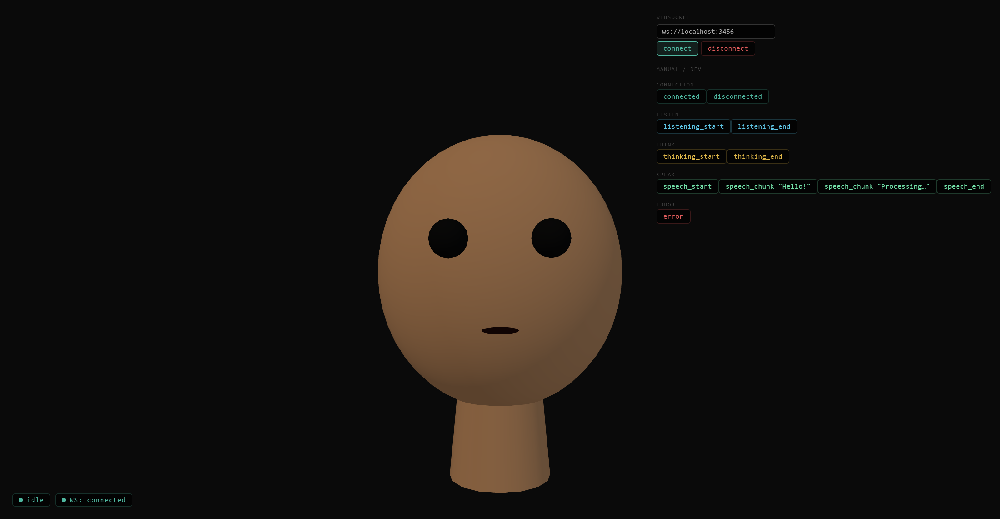

# FaceNode

Tired of talking to a faceless text box? FaceNode renders a 3D avatar that actually lip-syncs while your AI agent talks. It's like a coworker who only speaks when there's audio playing.



[](LICENSE)

---

## Features

- **Real-time 3D avatar** — procedural head (no assets required) or drop in any glTF/GLB model
- **State machine** — `disconnected → idle → listening → thinking → speaking → error` with clean lifecycle hooks
- **Dual-layer lip sync** — Layer 1: amplitude envelope (works with any TTS); Layer 2: OVR viseme frames (15-viseme set) with automatic Layer 1 fallback
- **Hermes adapter** — connects to a live Hermes AI agent via WebSocket with automatic reconnection, OR runs a scripted mock loop for development
- **Live dashboard** — three-column layout (controls · avatar · debug log), all config hot-applied, export/import/reset presets, localStorage persistence
- **Fully typed** — TypeScript strict mode throughout, Zod runtime validation on every event

---

## Quickstart

```bash
# 1. Clone and install
git clone https://github.com/asimons81/facenode.git
cd facenode
pnpm install

# 2. Start the mock event emitter (terminal 1)
pnpm mock

# 3. Start the avatar renderer (terminal 2)
pnpm --filter @facenode/web-avatar dev
# → http://localhost:5173

# 4. Start the dashboard (terminal 3)
pnpm --filter @facenode/dashboard dev
# → http://localhost:5174
```

### Test the full Hermes translation path

```bash
# Emit raw Hermes-format payloads instead of AvatarEvents
pnpm mock --hermes-mode

# In a second terminal: start a HermesAdapterServer that translates them
node --input-type=module <<'EOF'
import { HermesAdapterServer } from './packages/hermes-adapter/src/server.js';
const s = new HermesAdapterServer({ port: 3457, hermesWsUrl: 'ws://localhost:3456' });
await s.start();
console.log('Bridge running on ws://localhost:3457');
EOF

# Connect the dashboard/web-avatar to ws://localhost:3457
```

---

## Monorepo map

```
facenode/
├── packages/
│   ├── avatar-core/       State machine, Zod event schemas, AnimationController interface, AvatarConfig
│   ├── avatar-sdk/        Minimal AvatarEventDispatcher interface for building adapters
│   ├── hermes-adapter/    WebSocket bridge: HermesAdapterServer, HermesAdapterClient, MockHermesEmitter
│   └── ui/                Shared design tokens (dark/teal aesthetic)
│
├── apps/
│   ├── web-avatar/        Vite + Three.js renderer — procedural & glTF meshes, lip sync, React shell
│   └── dashboard/         Vite + React dashboard — live config, avatar preview, event log
│
└── examples/
    └── mock-demo/         Step-by-step walkthrough + custom emitter example
```

---

## How it works

**Event flow.** A Hermes AI agent emits JSON events (`tts.chunk`, `llm.start`, etc.) to `HermesAdapterServer` over WebSocket. The server translates them into typed `AvatarEvent` objects (validated with Zod) and rebroadcasts them to all connected avatar clients. `HermesAdapterClient` in the browser receives these, dispatches them to `AvatarController`, and the state machine drives every animation transition.

**Lip sync.** The system runs two parallel layers. Layer 1 is always active: an amplitude envelope from each `speech_chunk.amplitude` value drives a mouth-open morph target via a double-sine simulation at 60 fps. Layer 2 activates when `viseme_frame` events arrive with OVR phoneme weights; the `ThreeAnimationController` lerps between frames and automatically falls back to Layer 1 if no viseme frame is received for more than 100 ms.

**Config.** `AvatarConfig` (defined in `avatar-core`) is the single source of truth for every runtime parameter. The dashboard persists it to `localStorage` under `facenode:config` and applies changes immediately to the live `AvatarController`. The same schema validates imported JSON presets, so any config file that passes Zod validation can be hot-loaded.

---

## Documentation

- [Architecture](ARCHITECTURE.md) — package graph, event flow, design decisions
- [Contributing](CONTRIBUTING.md) — setup, scripts, PR process
- [Roadmap](ROADMAP.md) — v0.1 shipped, v0.2 current, future plans

---

## License

MIT © Tony Simons
