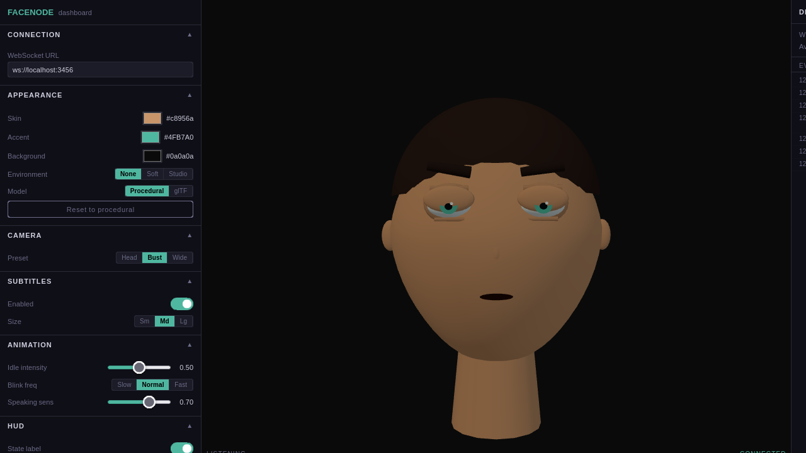

# FaceNode

Tired of talking to a faceless text box? FaceNode renders a 3D avatar that actually lip-syncs while your AI agent talks. It's like a coworker who only speaks when there's audio playing.



[](LICENSE)

---

## Features

- **Real-time 3D avatar** — procedural head (no assets required) or drop in any glTF/GLB model
- **State machine** — `disconnected ? idle ? listening ? thinking ? speaking ? error` with clean lifecycle hooks
- **Dual-layer lip sync** — Layer 1: amplitude envelope (works with any TTS); Layer 2: OVR viseme frames (15-viseme set) with automatic Layer 1 fallback
- **Hermes-first runtime** — Hermes payloads are normalized at the adapter edge into Runtime Contract v1 envelopes, with explicit drop reasons, per-source ordering, bounded reconnects, and runtime diagnostics for session/utterance visibility
- **Live dashboard** — three-column layout (controls · avatar · debug log), all config hot-applied, export/import/reset presets, localStorage persistence
- **Fully typed** — TypeScript strict mode throughout, Zod runtime validation on every event

---

## Quickstart

```bash
# 1. Clone and install
git clone https://github.com/asimons81/facenode.git
cd facenode
pnpm install

# 2. Start the mock event emitter (terminal 1)
pnpm mock

# 3. Start the avatar renderer (terminal 2)
pnpm --filter @facenode/web-avatar dev
# ? http://localhost:5201

# 4. Start the dashboard (terminal 3)
pnpm --filter @facenode/dashboard dev
# ? http://localhost:5202
```

### Test the full Hermes translation path

```bash
pnpm mock --hermes-mode

node --input-type=module <<'EOF'
import { HermesAdapterServer } from './packages/hermes-adapter/src/server.js';
const s = new HermesAdapterServer({ port: 3457, hermesWsUrl: 'ws://localhost:3456' });
await s.start();
console.log('Bridge running on ws://localhost:3457');
EOF
```

Point the dashboard or web-avatar at `ws://localhost:3457` to exercise the full Hermes payload -> runtime envelope -> browser client path.

---

## Monorepo map

```
facenode/
+-- packages/
¦   +-- avatar-core/       State machine, runtime envelope schema, reducers, shared config
¦   +-- avatar-sdk/        Minimal AvatarEventDispatcher interface for adapters
¦   +-- hermes-adapter/    HermesAdapterServer, HermesAdapterClient, MockHermesEmitter
¦   +-- ui/                Shared design tokens
¦
+-- apps/
¦   +-- web-avatar/        Vite + Three.js renderer
¦   +-- dashboard/         Vite + React dashboard with runtime diagnostics
¦
+-- examples/
    +-- mock-demo/         Walkthrough + custom emitter example
```

---

## How it works

**Event flow.** A Hermes AI agent emits JSON events (`tts.chunk`, `llm.start`, and friends) to `HermesAdapterServer` over WebSocket. The server validates and normalizes them into versioned runtime envelopes, carries session/utterance correlation forward when Hermes omits it, and broadcasts both envelopes and runtime diagnostics. `HermesAdapterClient` validates those transport messages in the browser, drops malformed/duplicate/out-of-order envelopes intentionally, then dispatches only the inner `AvatarEvent` to `AvatarController`.

**Reconnect behavior.** Upstream Hermes outages are treated as a real lifecycle boundary: the server emits a synthetic `disconnected` envelope immediately, enters bounded exponential reconnect, and surfaces the outage through diagnostics. Browser clients separately retry their local socket and expose their observed transport state through the dashboard debug panel.

**Lip sync.** Layer 1 uses `speech_chunk.amplitude` to drive mouth openness. Layer 2 uses `viseme_frame` events with the OVR 15-viseme set. If viseme frames stop arriving, the renderer falls back to amplitude-driven mouth motion automatically.

---

## Documentation

- [Runtime Contract v1](FACE_NODE_RUNTIME_V1.md) — canonical runtime envelope, diagnostics, drop reasons, and reconnect semantics
- [Architecture](ARCHITECTURE.md) — package graph, event flow, design decisions
- [Contributing](CONTRIBUTING.md) — setup, scripts, PR process
- [Roadmap](ROADMAP.md) — completed hardening work and next milestone

---

## License

MIT © Tony Simons
